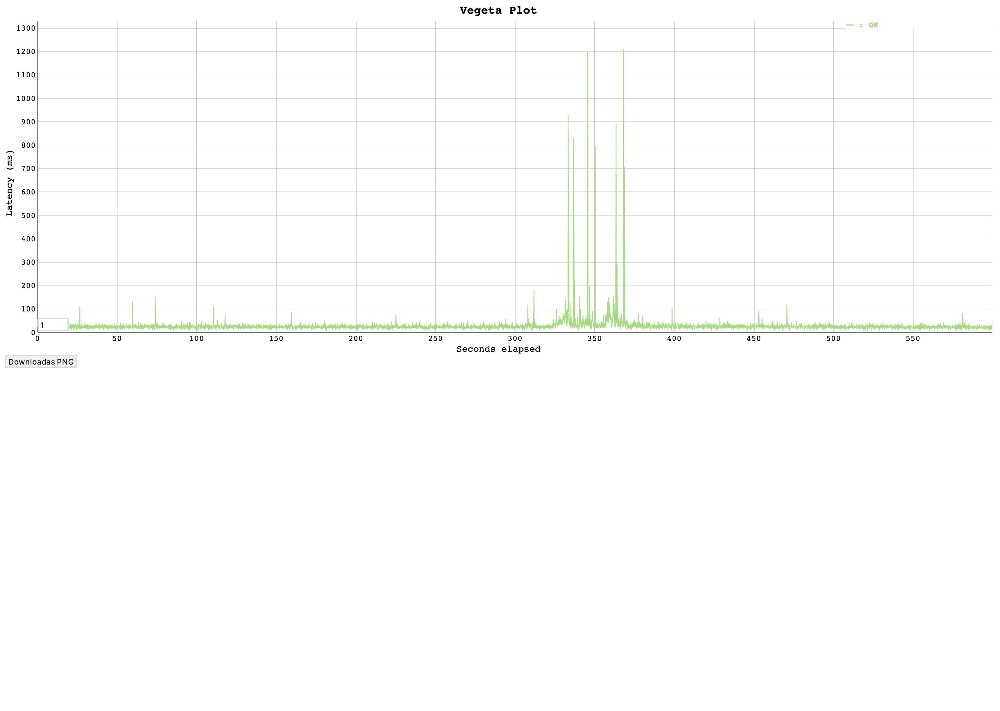

# Upgrade Istio Example


## Prep

```sh
kubectl create namespace istio-operator
kubectl create namespace istio-system
kubectl create namespace istio-gateways
kubectl create namespace istio-config

# Set environment variables
WORK_DIR=$(pwd)
ISTIO_9_VERSION=1.9.7
ISTIO_9_REVISION=1-9-7
ISTIO_9_DIR=$WORK_DIR/$ISTIO_9_REVISION
ISTIO_10_VERSION=1.10.3
ISTIO_10_REVISION=1-10-3
ISTIO_10_DIR=$WORK_DIR/$ISTIO_10_REVISION

```

## Deploy Istio 1.9.7

```sh
# in the 1-9-7 folder
cd $ISTIO_9_DIR
curl -L https://istio.io/downloadIstio | ISTIO_VERSION=$ISTIO_9_VERSION sh -

# Deploy operator
# cannot use helm install due to namespace ownership https://github.com/istio/istio/pull/30741
helm template istio-operator-$REVISION $ISTIO_9_DIR/istio-$ISTIO_9_VERSION/manifests/charts/istio-operator \
  --include-crds \
  --set operatorNamespace=istio-operator \
  --set watchedNamespaces="istio-system\,istio-gateways" \
  --set global.hub="docker.io/istio" \
  --set global.tag="$ISTIO_9_VERSION" \
  --set revision="$ISTIO_9_REVISION" > $ISTIO_9_DIR/operator.yaml

# apply the operator
kubectl apply -f $ISTIO_9_DIR/operator.yaml

# wait for operator to be ready
sleep 20s

# install IstioOperator spec
kubectl apply -f $ISTIO_9_DIR/istiooperator.yaml
```

## Deploy Istio Gateway 1.9.7

We will deploy a standalone instance of the ingressgateway without a loadbalanced service. Instead we will deploy our own loadBalancer service that we can use to migrate versions of gateways as we upgrade.

```sh
# in the 1-9-7 folder
cd $ISTIO_9_DIR

# copy configmap from istio-system to istio-gateways
CM_DATA=$(kubectl get configmap istio-$ISTIO_9_REVISION -n istio-system -o jsonpath={.data})
cat <<EOF > $ISTIO_9_DIR/istio-$ISTIO_9_REVISION.json
{
    "apiVersion": "v1",
    "data": $CM_DATA,
    "kind": "ConfigMap",
    "metadata": {
        "labels": {
            "istio.io/rev": "$ISTIO_9_REVISION"
        },
        "name": "istio-$ISTIO_9_REVISION",
        "namespace": "istio-gateways"
    }
}
EOF

kubectl apply -f $ISTIO_9_DIR/istio-$ISTIO_9_REVISION.json

kubectl apply -n istio-gateways -f $ISTIO_9_DIR/ingressgateway.yaml

# Deploy the LoadBalanced Service
cat <<EOF | kubectl apply -f -
apiVersion: v1
kind: Service
metadata:
  name: istio-ingressgateway
  namespace: istio-gateways
spec:
  type: LoadBalancer
  selector:
    istio: ingressgateway
    # select the $ISTIO_9_REVISION revision
    version: $ISTIO_9_REVISION
  ports:
  - name: status-port
    port: 15021
    targetPort: 15021
  - name: http2
    port: 80
    targetPort: 8080
  - name: https
    port: 443
    targetPort: 8443
  - name: tcp
    port: 31400
    targetPort: 31400
  - name: tls
    port: 15443
    targetPort: 15443
EOF
```

## Deploy Bookinfo

Install the bookinfo application in the `bookinfo` namespace with the sidecars using the 1-9-7 revision.

```sh
kubectl create namespace bookinfo

kubectl label ns bookinfo istio.io/rev=$ISTIO_9_REVISION

kubectl apply -n bookinfo -f $ISTIO_9_DIR/istio-$ISTIO_9_VERSION/samples/bookinfo/platform/kube/bookinfo.yaml

kubectl apply -n bookinfo -f $ISTIO_9_DIR/istio-$ISTIO_9_VERSION/samples/bookinfo/networking/bookinfo-gateway.yaml

# scale apps to 2
kubectl scale -n bookinfo --replicas=2 deployment/details-v1 deployment/ratings-v1 deployment/productpage-v1 deployment/reviews-v1 deployment/reviews-v2 deployment/reviews-v3


# Test that productpage is reachable
curl localhost:8080/productpage

```

## Generate Traffic

In a separete terminal, start generating some traffic as we upgrade istio to test that there is 0 downtime.

* install vegeta load test tool https://github.com/tsenart/vegeta
* run the 10 min load test that sends 10rps to localhost:8080/productpage: `./load/run.sh`

## Deploy Istio 1.10 Operator

Follow the same installation method with 1.9 but now for Istio 1.10

```sh
# in the 1-10-3 folder
cd $ISTIO_10_DIR
curl -L https://istio.io/downloadIstio | ISTIO_VERSION=$ISTIO_10_VERSION sh -

# Deploy operator
# cannot use helm install due to namespace ownership https://github.com/istio/istio/pull/30741
helm template istio-operator-$REVISION $ISTIO_10_DIR/istio-$ISTIO_10_VERSION/manifests/charts/istio-operator \
  --include-crds \
  --set operatorNamespace=istio-operator \
  --set watchedNamespaces="istio-system\,istio-gateways" \
  --set global.hub="docker.io/istio" \
  --set global.tag="$ISTIO_10_VERSION" \
  --set revision="$ISTIO_10_REVISION" > $ISTIO_10_DIR/operator.yaml

# apply operator yaml
kubectl apply -f $ISTIO_10_DIR/operator.yaml

# wait for operator to be ready
sleep 20s

# install IstioOperator spec
kubectl apply -f $ISTIO_10_DIR/istiooperator.yaml

```

## Deploy Gateway 1.10.3

We will be deploying the 1.10.3 gateway but it will be unused at the moment due to the LoadBalanced service still pointing to the 1.9.7 revision gateways.

```sh
# in the 1-10-3 folder
cd $ISTIO_10_DIR

# copy configmap from istio-system to istio-gateways
CM_DATA=$(kubectl get configmap istio-$ISTIO_10_REVISION -n istio-system -o jsonpath={.data})
cat <<EOF > $ISTIO_10_DIR/istio-$ISTIO_10_REVISION.json
{
    "apiVersion": "v1",
    "data": $CM_DATA,
    "kind": "ConfigMap",
    "metadata": {
        "labels": {
            "istio.io/rev": "$ISTIO_10_REVISION"
        },
        "name": "istio-$ISTIO_10_REVISION",
        "namespace": "istio-gateways"
    }
}
EOF

kubectl apply -f $ISTIO_10_DIR/istio-$ISTIO_10_REVISION.json

kubectl apply -n istio-gateways -f $ISTIO_10_DIR/ingressgateway.yaml
```

## Migrate Bookinfo to 1.10.3

```sh
# change label to 1.10.3
kubectl label ns bookinfo istio.io/rev=$ISTIO_10_REVISION --overwrite

# roll all of the applications 1 at a time
kubectl rollout restart deployment -n bookinfo details-v1
sleep 20s
kubectl rollout restart deployment -n bookinfo ratings-v1
sleep 20s
kubectl rollout restart deployment -n bookinfo productpage-v1
sleep 20s
kubectl rollout restart deployment -n bookinfo reviews-v1
sleep 20s
kubectl rollout restart deployment -n bookinfo reviews-v2
sleep 20s
kubectl rollout restart deployment -n bookinfo reviews-v3

```

## Migrate Gateway to 1.10.3

```sh
# Update the LoadBalanced Service
cat <<EOF | kubectl apply -f -
apiVersion: v1
kind: Service
metadata:
  name: istio-ingressgateway
  namespace: istio-gateways
spec:
  type: LoadBalancer
  selector:
    istio: ingressgateway
    # select the $ISTIO_10_REVISION revision
    version: $ISTIO_10_REVISION
  ports:
  - name: status-port
    port: 15021
    targetPort: 15021
  - name: http2
    port: 80
    targetPort: 8080
  - name: https
    port: 443
    targetPort: 8443
  - name: tcp
    port: 31400
    targetPort: 31400
  - name: tls
    port: 15443
    targetPort: 15443
EOF
```

## cleanup assets

We should be able to leverage the 1-9-7 operator to uninstall the old istio assets. Once that is complete we can cleanup the old operator as well.

```sh
kubectl delete -f $ISTIO_9_DIR/ingressgateway.yaml
kubectl delete -f $ISTIO_9_DIR/istiooperator.yaml

# give 2 min to cleanup
sleep 120s

# remove operator
kubectl delete -f $ISTIO_9_DIR/operator.yaml
```

## Validate Traffic

Once the load traffic script is complete a graph of the requests is available to view at `open $WORK_DIR/plot.html`.

* Example Stats - The below output is the statistics of my run. It shows that we recieved 6000 `200` response codes and no error codes.

```txt
Requests      [total, rate, throughput]         6000, 10.00, 10.00
Duration      [total, attack, wait]             10m0s, 10m0s, 26.776ms
Latencies     [min, mean, 50, 90, 95, 99, max]  15.344ms, 29.06ms, 25.727ms, 33.811ms, 41.936ms, 85.286ms, 1.212s
Bytes In      [total, mean]                     29091004, 4848.50
Bytes Out     [total, mean]                     0, 0.00
Success       [ratio]                           100.00%
Status Codes  [code:count]                      200:6000  
Error Set:
```

* Example Plot - As you can see there was a spike in latency when we were migrating the applications to the new sidecar. We could fix these spikes by configuring the application scaling properties.

